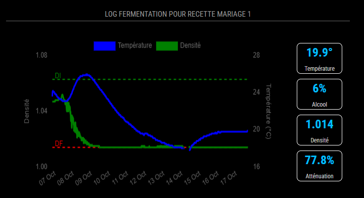

# Français 
## MMM-LittleBockFermentationLog

**MMM-LittleBockFermentationLog** est un module pour [MagicMirror²](https://github.com/MichMich/MagicMirror) qui permet d'afficher le suivi de la fermentation de brassins de bière en utilisant l'API de Little Bock.

### Layout horizontal

### Layout CardsOnly


## Installation

Clonez ce dépôt dans votre dossier de modules MagicMirror :

```bash
cd ~/MagicMirror/modules
git clone https://github.com/SBrendan/MMM-LittleBockFermentationLog
```

## Configuration

Vous pouvez ajouter le module dans le fichier `config.js` de MagicMirror avec les options suivantes :

| Option             | Valeur par défaut   | Description                                                                                                                                                                                                |
| ------------------ | ------------------- | ---------------------------------------------------------------------------------------------------------------------------------------------------------------------------------------------------------- |
| `apiToken`         | `""`                | **Obligatoire**. Votre token d'API Little Bock. <br> **Type**: `string`                                                                                                                                    |
| `brewSessionID`    | `0`                 | **Obligatoire**. L'ID de la session de brassage à afficher. <br> **Type**: `string`                                                                                                                        |
| `updateInterval`   | `3600000` (1 heure) | Intervalle de mise à jour des données en millisecondes. <br> **Type**: `integer`                                                                                                                           |
| `animationSpeed`   | `1000`              | Vitesse de l'animation lors de la mise à jour des informations. <br> **Type**: `integer`                                                                                                                   |
| `layout`           | `"horizontal"`      | Choix de l'agencement des éléments (graphique et cartes). <br> **Type**: `string` <br> **Valeurs possibles**: `"cardsOnly"`, `"horizontal"`                                                                |

### Exemple de configuration dans `config.js`

```js
{
    module: "MMM-LittleBockFermentationLog",
    position: "top_right",
    config: {
        apiToken: "VOTRE_TOKEN",
        brewSessionID: "57094",
        updateInterval: 60 * 60 * 1000, // Mise à jour toutes les heures
        animationSpeed: 1000, // 1 seconde
        layout: "horizontal", // Choix du layout : cardsOnly, horizontal
    }
},
```

## Cache et Limite de Taux d'API

Le module utilise un système de cache pour éviter de dépasser la limite de 150 requêtes par heure imposée par Little Bock. À l'initialisation, toutes les pages de données de fermentation sont chargées et stockées en cache. Par la suite, le module ne vérifie que les nouvelles pages disponibles toutes les heures, ce qui permet de limiter les appels à l'API tout en s'assurant que les données restent à jour.

## Fonctionnalités

- **Affichage du suivi de la fermentation** : Le module affiche la température, la densité, le taux d'alcool estimé et l'atténuation dans une grille de cartes et/ou un graphique.
- **Layouts personnalisables** : Choisissez entre l'affichage de seulement les cartes, un layout vertical ou horizontal pour adapter le module à vos préférences.
- **Cache de données** : Le module utilise un cache pour réduire les appels à l'API, récupérant toutes les pages au démarrage, et vérifiant les nouvelles pages disponibles toutes les heures.

## Remerciements

- Merci à l'équipe de [Little Bock](https://www.littlebock.fr/) pour leur API et leur soutien à la communauté des brasseurs.
- Un grand merci à [Michael Teeuw](https://github.com/MichMich) pour la création de [MagicMirror²](https://github.com/MichMich/MagicMirror), le framework qui a rendu ce module possible.


# English

## MMM-LittleBockFermentationLog

**MMM-LittleBockFermentationLog** is a module for [MagicMirror²](https://github.com/MichMich/MagicMirror) that displays beer brewing fermentation tracking using the Little Bock API.

### Horizontal Layout

### CardsOnly Layout


## Installation

Clone this repository into your MagicMirror modules folder:

```bash
cd ~/MagicMirror/modules
git clone https://github.com/SBrendan/MMM-LittleBockFermentationLog
```

## Configuration

You can add the module in the MagicMirror `config.js` file with the following options:

| Option             | Default value       | Description                                                                                                                                                                                                |
| ------------------ | ------------------- | ---------------------------------------------------------------------------------------------------------------------------------------------------------------------------------------------------------- |
| `apiToken`         | `""`                | **Required**. Your Little Bock API token. <br> **Type**: `string`                                                                                                                                          |
| `brewSessionID`    | `0`                 | **Required**. The ID of the brewing session to display. <br> **Type**: `string`                                                                                                                            |
| `updateInterval`   | `3600000` (1 hour)  | Interval for data updates in milliseconds. <br> **Type**: `integer`                                                                                                                                        |
| `animationSpeed`   | `1000`              | Speed of the animation when updating the information. <br> **Type**: `integer`                                                                                                                             |
| `layout`           | `"horizontal"`      | Layout choice for the elements (graph and cards). <br> **Type**: `string` <br> **Possible values**: `"cardsOnly"`, `"horizontal"`                                                                           |

### Example configuration in `config.js`

```js
{
    module: "MMM-LittleBockFermentationLog",
    position: "top_right",
    config: {
        apiToken: "YOUR_TOKEN",
        brewSessionID: "57094",
        updateInterval: 60 * 60 * 1000, // Updates every hour
        animationSpeed: 1000, // 1 second
        layout: "horizontal", // Layout options: cardsOnly, horizontal
    }
},
```

## Caching and API Rate Limit

The module uses a cache system to avoid exceeding the 150 requests per hour limit imposed by Little Bock. On initialization, all fermentation data pages are loaded and stored in the cache. The module then checks only for new available pages every hour, reducing API calls while ensuring the data stays up to date.

## Features

- **Fermentation tracking display**: The module displays temperature, gravity, estimated alcohol content, and attenuation in a card grid and/or graph.
- **Customizable layouts**: Choose between displaying only cards or a vertical or horizontal layout to fit your preferences.
- **Data caching**: The module uses caching to reduce API calls, fetching all pages on startup and checking for new pages every hour.

## Acknowledgments

- Thanks to the team at [Little Bock](https://www.littlebock.fr/) for their API and support for the brewing community.
- A big thank you to [Michael Teeuw](https://github.com/MichMich) for creating [MagicMirror²](https://github.com/MichMich/MagicMirror), the framework that made this module possible.